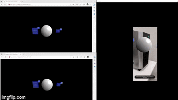

# Corquet.io-examples

This repository contains some examples of applications made using BABYLON.js and Croquet.io

In detail the examples realized have as objective to create a collaborative XR experience thanks to the use of WebXR.

## Change Color Hologram example

This example gives the possibility to the different connected users to view the same hologram and to be able to modify the color by means of a dedicated menu, realized through the support to the MRTK that BABYLON.js provides.

You can find the example in the directory `ExampleChangeColorHologram`.


**Notice**: the little latency that you see is due to the screen mirroring application to project the smartphone screen on te PC. 

## Manipulate Hologram example

This example shows how it is possible to enable the manipulation of the hologram thanks to the elements made available by BABYLON.js and how to propagate the changes to other connected users.

You can find the example in the directory `WebXRApp`.



**Notice**: the little latency that you see is due to the screen mirroring application to project the smartphone screen on te PC. 


## How to run the examples

Since WebXR only works on secure sites (https) or localhost, in order to launch the application with a specific IP address, you must associate a certificate to the web page. To do this you can use openssl and execute the following commands in the application directory:

```shell
openssl genrsa -out private_key.pem
```

```shell
openssl req -new -key private_key.pem -out csr.pem
```

```shell
openssl x509 -req -days 9999 -in csr.pem -signkey private_key.pem -out cert.pem
```

Once you have created the certificate you can launch the application by running the following commands:

```shell
npm install
```

```shell
node app.js
```